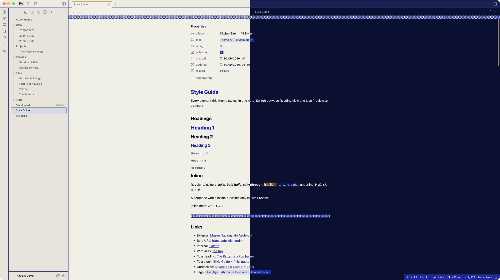
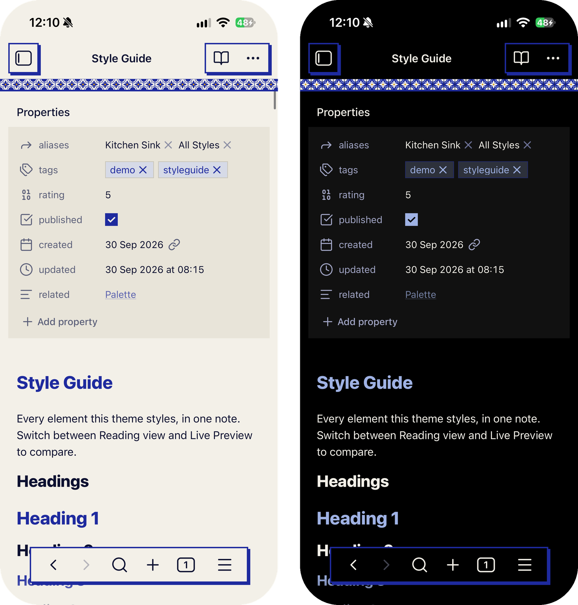

# Azulejo Brutalism

An Obsidian theme build from love of Portuguese Azulejo tiling and brutalism, ink on glaze in light mode and glaze on ink in dark. Square corners everywhere, flat surfaces, hard offset shadows instead of soft ones. Screams brutalism, minimalism but with a twist. Works both on desktop and mobile.

## Install

Settings → Appearance → Themes → Manage, search for **Azulejo Brutalism**, then Install and use.

Leave Settings → Appearance → Accent color on its default: the theme uses Cobalt in light mode and a paler Wash blue in dark, and a picked colour overrides both.

## Options

With the [Style Settings](https://github.com/mgmeyers/obsidian-style-settings) plugin, Settings → Style Settings → Azulejo Brutalism has three toggles:

- **OLED dark**: true black behind everything in dark mode.
- **Uppercase labels**: H1, H4–H6, table headers, callout titles and the status bar in capitals.
- **Heading rules**: a thick rule under the title and H1, a thinner one under H2.

## Other apps

The same palette for NotePlan, Ghostty, Zed, Neovim, Xcode, VS Code, JetBrains and more is in [AzulejoBrutalism](https://github.com/VerticalHeretic/AzulejoBrutalism).

## Licence

[MIT](LICENSE)
